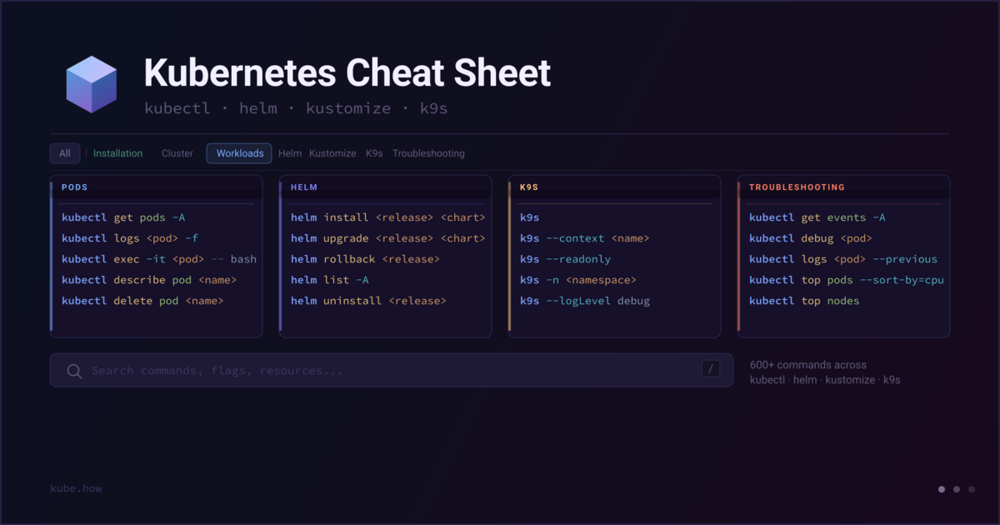

# Kubernetes Cheat Sheet

A fast, searchable web reference for everyone who works with Kubernetes day to day. No login, no ads, no tracking, no install – open the page and use it.

**Live at [kube.how](https://kube.how/)**



---

## What it covers

Over 600 commands across seven categories, each with a short plain-English description and a one-click copy button.

| Category | Sections |
|---|---|
| **Installation** | Kubeadm, K3s, K3d, KinD, Minikube |
| **Cluster** | Cluster Health, Nodes, Custom Resources, Contexts |
| **Workloads** | Pods, Deployments, StatefulSets, DaemonSets, Services, ConfigMaps & Secrets, Jobs & CronJobs, Volumes, Networking, RBAC, Namespaces |
| **Helm** | Releases, Charts |
| **Kustomize** | Manage, Edit |
| **K9s** | CLI & Launch, UI Shortcuts |
| **Troubleshooting** | Installation, Kubectl, Helm, Kustomize, K9s |

---

## How to use it

- **Click any command** to copy it to the clipboard instantly.
- **Top navigation** switches between categories. Sub-navigation narrows it down to a specific section.
- **Search** filters across all commands and descriptions at once. Hit `/` to focus the search field from anywhere on the page, `Esc` to clear it.
- **Keyboard shortcuts** `1`–`8` jump between top-level categories without touching the mouse.
- **Deep links** work – the URL updates as you navigate, so you can bookmark or share a specific section directly (e.g. `kube.how/#helm`).
- **Contacts** button in the header opens a dropdown with links to the community channels.
- **Sponsor** button opens a dropdown with a donation link and crypto wallet addresses – click the copy icon next to any address to copy it in full.

---

## Stack

The project is intentionally dependency-free. There is no framework, no bundler, and no npm involved.

- **HTML / CSS / JavaScript** – plain ES6 modules, no build step
- **Google Fonts** – Space Grotesk for the UI, JetBrains Mono for commands
- **nginx** – web server inside the Docker image, with gzip and static asset caching configured
- **GitHub Actions** – automatic deployment to GitHub Pages on every push to `main`
- **GitHub Pages + Cloudflare** – hosting with the custom domain `kube.how`, full SSL, and edge caching

All content lives in `js/data.js` as a structured array. Adding or editing commands means touching that one file only – no templates, no CMS.

Contacts and sponsor information lives in `js/contacts.js`. This file is optional – delete it to ship a build without the Contacts and Sponsor header buttons; the rest of the app is unaffected.

---

## Running locally

No build step needed. Any static file server works:

```bash
# Python (built-in)
python3 -m http.server 8888 --bind 0.0.0.0
```

Then open [http://localhost:8888](http://localhost:8888).

---

## Docker

Build and run with nginx:

```bash
docker build -t kube-cheatsheet .
docker run -d --name kube-cheatsheet -p 8080:80 kube-cheatsheet
```

Open [http://localhost:8080](http://localhost:8080).

To rebuild after making changes:

```bash
docker rm kube-cheatsheet
docker build -t kube-cheatsheet .
docker run -d --name kube-cheatsheet -p 8080:80 kube-cheatsheet
```

---

## Contributing

Content edits go in `js/data.js` – each section is a plain JS object with a `groups` array, each group has a `title`, `desc`, and `cmds` list. Commands are sorted automatically on render, so order inside the array doesn't matter.

To update contacts or sponsor links, edit `js/contacts.js`. To remove the header buttons entirely, delete that file.

If you spot a wrong flag, a missing command, or a broken description – pull requests are welcome.

---

## License

MIT © [Ivan Medaev](https://t.me/opengrad)
