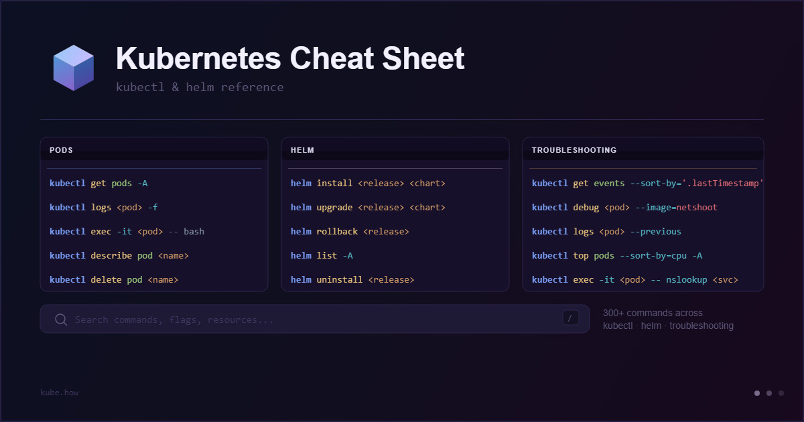

# Kubernetes Cheat Sheet

**Kubernetes Cheat Sheet** is a searchable web reference for kubectl, Helm, and K9s. The site covers the most commonly used commands across all typical day-to-day Kubernetes workflows: managing workloads, inspecting cluster state, working with Helm releases, navigating K9s, and diagnosing common issues. Each command has a short description and a copy button. No login, no ads, no install required — just open and use.

Available at [kube.how](https://kube.how/).



## Content

The reference is split into five categories:

- **Workloads:** Pods, Deployments, StatefulSets, DaemonSets, Services, Namespaces, ConfigMaps & Secrets, Jobs & CronJobs, Volumes, Networking, RBAC
- **Cluster:** Cluster Health, Nodes, Contexts
- **Helm:** Releases, Charts
- **K9s:** CLI & Launch, UI Shortcuts
- **Troubleshooting:** Kubectl, K9s, Helm

550+ commands in total.

## Stack

- **HTML / CSS / JavaScript:** no framework, no bundler, no npm
- **Google Fonts:** Space Grotesk (UI) and JetBrains Mono (commands)
- **nginx:** web server inside the Docker image
- **GitHub Pages:** hosting with a custom domain

## Running locally

The project has no build step, so any static file server works:

```bash
python3 -m http.server 8888 --bind 0.0.0.0
```

## Docker

```bash
docker build -t kube-cheatsheet .
docker run -d --name kube-cheatsheet -p 8080:80 kube-cheatsheet
```

To rebuild after changes:

```bash
docker stop kube-cheatsheet && docker rm kube-cheatsheet
docker build -t kube-cheatsheet . && docker run -d --name kube-cheatsheet -p 8080:80 kube-cheatsheet
```
