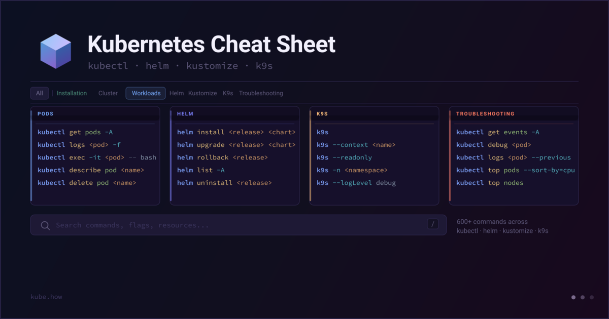

# Kubernetes Reference

A fast, searchable web reference for everyone who works with Kubernetes day to day: a command cheat sheet and a library of animated architecture diagrams. No login, no ads, no tracking, no install, just open the page and use it.

**Live at [kube.how](https://kube.how/)**



---

## What it is

One static site made of three path-based sub-apps that share the same visual chrome but are otherwise independent:

| Path | Sub-app | What it is |
|---|---|---|
| `/` | **Hub** | One-viewport landing page: two entry panels over an aurora background and a canvas packet graph |
| `/cli/` | **Commands** | Searchable `kubectl` / Helm / Kustomize / K9s cheat sheet, 890 commands, copy + star |
| `/scheme/` | **Schemes** | Grid of 108 animated SVG diagrams: click a card and a step-by-step animation explains the mechanism |

---

## Commands (`/cli/`)

890 commands across eight categories, each with a short plain-English description, a one-click copy button, and a star to save personal favourites. Every section header shows its total command count.

| Category | Commands | Sections |
|---|---|---|
| **Installation** | 144 | Kubeadm, k3s, k3d, KinD, Minikube |
| **Cluster** | 88 | Cluster Health, Nodes, Custom Resources, Contexts |
| **Workloads** | 325 | Pods, Deployments, StatefulSets, DaemonSets, Services, ConfigMaps & Secrets, Jobs & CronJobs, Volumes, Networking, RBAC, Namespaces |
| **Helm** | 60 | Releases, Charts |
| **Kustomize** | 34 | Manage, Edit |
| **K9s** | 75 | CLI & Launch, UI Shortcuts |
| **Debug K8s** | 135 | Installation, Cluster, Network, Storage, Resources, Scheduling |
| **Debug Tools** | 29 | Helm, Kustomize, K9s |

**How to use it**

- **Click any command** to copy it to the clipboard instantly.
- **Star a command** with the icon left of the copy button to save it to your personal Starred view (top-right of the nav). Stars persist across reloads in your browser only: nothing leaves the page.
- **Top navigation** switches between groups. Mid- and sub-navigation narrow it down to a specific category and section.
- **Search** filters across all commands and descriptions at once. `Esc` clears the field. Search keeps working inside the Starred view, narrowing the favourites list further.
- **Deep links** work: the URL updates as you navigate, so you can bookmark or share a specific section directly (e.g. `kube.how/cli/#helm` or `kube.how/cli/#starred`).

---

## Schemes (`/scheme/`)

108 animated diagrams of how Kubernetes actually works internally. Each card opens a dialog that plays the mechanism step by step, with a narration panel explaining what moves and why.

| Category | Cards | Subcategories |
|---|---|---|
| **Cluster** | 21 | Control Plane, Node Runtime, Node Lifecycle |
| **Workloads** | 19 | Pods Bootstrap, Pods Lifecycle, Controllers |
| **Networking** | 37 | Network Foundations, Pod Networking, Services & Endpoints, External Traffic, DNS & Service Discovery |
| **Storage** | 31 | Volume Foundations, Volumes & Claims, CSI & Mount Path, Stateful Data |

Every category carries its own accent colour, so the palette tells you where you are: indigo for Cluster, sky blue for Workloads, cyan for Networking, jade for Storage.

**How to use it**

- **Click a card** to open its diagram. It starts on a static poster, then auto-plays the first step.
- **Playback controls**: `Space` play/pause, `←` / `→` previous and next step, `R` reset, `Esc` close. Speed is adjustable.
- **Search and filter** by category, or search across titles and descriptions.
- **Deep links** work here too: `kube.how/scheme/#scheme=<id>` opens a specific diagram, and the browser Back button closes it.
- **Reduced motion** is respected: with `prefers-reduced-motion` each step snaps straight to its end state instead of animating.

Diagrams are hand-built SVG driven by the Web Animations API inside a native `<dialog>`. No diagram library, no canvas, no WebGL.

---

## Stack

The project is intentionally dependency-free. No framework, no bundler, no npm at runtime.

- **HTML / CSS / JavaScript**: plain ES modules loaded directly by the browser, no build step
- **SVG + Web Animations API**: all diagram motion, no animation library
- **Google Fonts**: Space Grotesk for the UI, JetBrains Mono for commands
- **nginx**: web server inside the Docker image, with gzip, security headers, and no-cache static assets so a local rebuild shows up right away
- **GitHub Actions**: automatic deployment to GitHub Pages on every push to `main`, plus a tagged release artifact
- **GitHub Pages + Cloudflare**: hosting with the custom domain `kube.how`, full SSL, and edge caching

Command content lives in `cli/js/data.js` as one structured array. Adding or editing commands means touching that one file only: no templates, no CMS. Scheme content is grouped by category: `scheme/js/schemes/<category>/` holds that category's card modules, its catalogue, its grid posters and its drawing kit, so adding a diagram is a one-folder operation.

Contacts and sponsor information lives in `cli/js/contacts.js`, with a second copy in `scheme/js/contacts.js` so each path prefix stays self-contained. Both are optional: delete a copy to ship without the Contacts and Sponsor header buttons on the pages that import it (`cli/js/contacts.js` covers the hub and Commands, `scheme/js/contacts.js` covers Schemes), and the rest of the app is unaffected.

`scheme/test/` is a Node test suite on the built-in test runner: unit tests over the catalogue, the card modules and the prose, render tests that drive a headless browser (Playwright) through every step of every diagram, and reporting probes for animation and geometry. It has to be green before a change lands. It is dev-only and never shipped.

---

## Repository layout

```
index.html               hub landing page, self-contained
cli/                     commands sub-app (data.js, app.js, styles.css)
scheme/                  schemes sub-app
  js/app.js              router, grid, dialog lifecycle
  js/data.js             barrel: category registry + the four card manifests
  js/lib/                shared primitives, timeline, animation tokens
  js/schemes/<category>/ one folder per category: its cards, kit, catalogue, posters, design record
  css/                   tokens, layout, SVG diagram classes
  test/                  dev-only test suite, not shipped
images/                  og image
configs/nginx.conf       Docker-only nginx config
```

---

## Running locally

No build step needed. Any static file server works:

```bash
# Python (built-in)
python3 -m http.server 8888 --bind 0.0.0.0
```

Then open [http://localhost:8888](http://localhost:8888) for the hub, `/cli/` for commands, `/scheme/` for schemes. All paths inside each sub-app are relative, so the same files work locally and in production.

---

## Docker

Build and run with nginx:

```bash
docker build -t kube-cheatsheet .
docker run -d --name kube-cheatsheet -p 8080:80 kube-cheatsheet
```

Open [http://localhost:8080](http://localhost:8080).

To rebuild after making changes:

```bash
docker rm -f kube-cheatsheet
docker build -t kube-cheatsheet .
docker run -d --name kube-cheatsheet -p 8080:80 kube-cheatsheet
```

---

## Contributing

Command edits go in `cli/js/data.js`: each section is a plain JS object with a `groups` array, each group has a `title`, `desc`, and `cmds` list. Commands are sorted automatically on render, so order inside the array does not matter.

New diagrams live entirely inside one category folder: a module `scheme/js/schemes/<category>/<id>.js` exporting its scene and its steps as data (`SCENE` and `STEPS_SPEC`) plus the `init(root, callbacks)` the dialog calls, an entry in that folder's `cards.js`, and a grid poster in its `posters.js`. The existing cards in the category are the reference: build on that folder's `<category>-kit.js` rather than starting from scratch.

To update contacts or sponsor links, edit `cli/js/contacts.js` and its `scheme/js/contacts.js` counterpart. To remove the header buttons entirely, delete both.

If you spot a wrong flag, a missing command, or a broken description, pull requests are welcome.

---

## License

MIT © [Ivan Medaev](https://t.me/opengrad)
